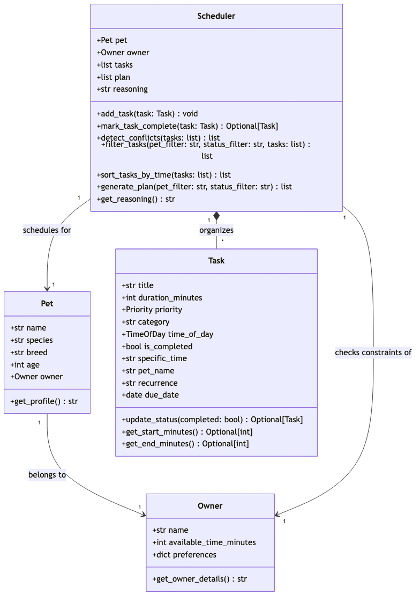

# 🐾 PawPal+ — Smart Pet Care Planner

PawPal+ is a Streamlit and CLI-powered scheduling assistant designed to help busy pet owners maintain consistency in their companion's care. By analyzing daily time constraints, preferred windows, and precise time blocks, PawPal+ generates an optimized daily care plan and provides clear explanations of its scheduling choices.

---

## ✨ Features

- **🕒 Constraint-Aware Scheduling**: Evaluates the owner's daily available time limit and schedules tasks without exceeding the time budget.
- **⚡ Interval-Based Gap-Filling**: Intelligently slots flexible tasks around fixed-time appointments to maximize time utilization.
- **⚠️ Basic Conflict Detection**: Scans the pool for overlapping specific start times and raises warnings in the UI before schedule generation.
- **🔄 Recurring Task Rollovers**: Automatically spawns the next occurrence (calculated via Python `timedelta` for daily/weekly intervals) when a task is checked off as completed.
- **🐾 Multi-Pet Schedules**: Supports sorting and filtering the care task pool and generated schedules by specific pets.

---

## 📐 UML Class Diagram

Below is the finalized UML class diagram showing the system architecture, relationships, attributes, and methods of the core entities (`Owner`, `Pet`, `Task`, and `Scheduler`):



---

## ⚙️ Smarter Scheduling Engine

The scheduling core in [pawpal_system.py](pawpal_system.py) implements the following features:

### 1. Chronological & Priority Task Sorting
*   **Method**: `Scheduler.sort_tasks_by_time(tasks)`
*   **Behavior**: Sorts tasks by placing fixed-time tasks (those with specific `HH:MM` start times) chronologically first. Flexible tasks are ordered next based on their preferred time window (`Morning` -> `Afternoon` -> `Evening` -> `Any`) and sub-sorted by Priority (`High` -> `Medium` -> `Low`).

### 2. Multi-Pet & Status Filtering
*   **Method**: `Scheduler.filter_tasks(pet_filter, status_filter, tasks)`
*   **Behavior**: Filters any task list by ownership (matching specific pet name or shared `"All"` tasks) and completion status (`Pending` vs `Completed`).

### 3. Basic Conflict Detection
*   **Method**: `Scheduler.detect_conflicts(tasks)`
*   **Behavior**: Scans for overlapping fixed time blocks. Any overlaps are flagged as warnings in the UI and automatically skipped during schedule generation to avoid double-booking.

### 4. Recurring Task Auto-Generation
*   **Methods**: `Task.update_status(completed)` & `Scheduler.mark_task_complete(task)`
*   **Behavior**: Transitioning a `"daily"` or `"weekly"` task to completed automatically instantiates a new, pending `Task` instance for the next occurrence (using `timedelta` to calculate `today + 1 day` or `today + 7 days`).

---

## 🚀 Getting Started

### 1. Setup & Installation
Clone the repository and install dependencies in a virtual environment:
```bash
python -m venv .venv
source .venv/bin/activate  # Windows: .venv\Scripts\activate
pip install -r requirements.txt
```

### 2. Run the Streamlit Application
Launch the visual web dashboard:
```bash
streamlit run app.py
```

### 3. Run the CLI Demo
Run the command-line entry point to print pool conflicts and schedule planning skips to the terminal:
```bash
python3 main.py
```

---

## 📸 Demo Walkthrough

1.  **Configure Profiles & Constraints**: In the left sidebar panel under `👤 Profiles & Constraints`, enter your name, daily available care budget, and your pet's profile.
2.  **Add & Manage Tasks in the Pool**:
    - Use the form under `📝 Add Pet Care Task` to register tasks with durations, priorities, categories, recurrence (Daily, Weekly), or specific start times (e.g. `08:00`).
    - Mark tasks complete interactively via check-boxes. Completed tasks are highlighted with green success banners and strikethroughs, while pending tasks are displayed in blue info boxes.
3.  **Monitor Time Conflicts**: If you schedule overlapping fixed-time tasks (e.g. Walk at 08:00 for 30 mins and feeding at 08:15), the system will display a warning banner above the list (`⚠️ Time Conflict Warning in Pool`) highlighting the issue.
4.  **Generate a Constraint-Aware Schedule**: Select your filters (Filter by Pet, Filter by Status) and click `⚡ Generate Daily Schedule`. The solver schedules fixed tasks first, then packs flexible tasks into remaining free gaps.
5.  **Review Plan and Reasoning**:
    - View the chronological timeline and time utilization metrics.
    - Inspect the `🧠 Scheduling Engine Reasoning` log to review step-by-step logs of which tasks were scheduled, which conflicted, and which exceeded the daily available time constraint.

---

## 🧪 Testing PawPal+

To run the automated test suite of 13 tests (covering edge cases like boundary conflicts, tie-breakers, and date rollovers):

```bash
PYTHONPATH=. .venv/bin/pytest
```

### Sample Test Output:
```text
============================= test session starts ==============================
platform darwin -- Python 3.14.5, pytest-9.1.1, pluggy-1.6.0
rootdir: /Users/wizofoz/Documents/FAU/2026-2 Fall/CODEPATH_AI01_Foundation/WEEK3/ai110-module2show-pawpal-starter
plugins: anyio-4.14.1
collected 13 items

tests/test_pawpal.py .............                                       [100%]

============================== 13 passed in 0.03s ==============================
```

---

## 🖥️ Sample CLI Output

Here is the terminal output from running `python3 main.py` with conflicting tasks at `08:00`:

```text
=== 1. ALL POOL TASKS (AS ADDED - OUT OF ORDER) ===
  • [Mochi] Mochi Evening Brush (15m) in evening [Priority: LOW]
  • [Biscuit] Biscuit Afternoon Walk (30m) in afternoon [Priority: HIGH]
  • [Mochi] Mochi Morning Feed (15m) at 08:00 [Priority: HIGH]
  • [Biscuit] Biscuit Morning Walk (25m) at 08:00 [Priority: HIGH]
  • [All] Shared Playtime (20m) in afternoon [Priority: MEDIUM]

=== RUNNING POOL CONFLICT DETECTION ===
⚠️  Warning: Detected schedule time conflicts in the task pool!
  - Conflict: 'Mochi Morning Feed' (08:00) overlaps with 'Biscuit Morning Walk' (08:00)

=== 2. FILTERED TASKS (PET: MOCHI + SHARED) ===
  • [Mochi] Mochi Evening Brush (15m) in evening [Priority: LOW]
  • [Mochi] Mochi Morning Feed (15m) at 08:00 [Priority: HIGH]
  • [All] Shared Playtime (20m) in afternoon [Priority: MEDIUM]

=== 3. FILTERED & CHRONOLOGICALLY SORTED TASKS (PET: MOCHI) ===
  • [Mochi] Mochi Morning Feed (15m) at 08:00 [Priority: HIGH]
  • [All] Shared Playtime (20m) in afternoon [Priority: MEDIUM]
  • [Mochi] Mochi Evening Brush (15m) in evening [Priority: LOW]

=== 4. GENERATED PLAN FOR MOCHI (FILTERED & CONSTRAINED) ===

┌────────────────────────────────────────────────────────────────────────┐
│                    🐾 TODAY'S PET CARE PLAN: JORDAN                     │
└────────────────────────────────────────────────────────────────────────┘
  Time Budget: 120 mins | Scheduled: 50 mins (41.7% Used)
  Progress:    [████████████░░░░░░░░░░░░░░░░░░]

┌──────────────┬──────────────────────────────┬────────────┬─────────────┐
│ TIME SLOT    │ TASK DESCRIPTION             │ DURATION   │ PRIORITY    │
├──────────────┼──────────────────────────────┼────────────┼─────────────┤
│ 08:00 - 08:15 │ 🥣 Mochi Morning Feed         │ 15 min     │ HIGH        │
│ 13:00 - 13:20 │ 🧸 Shared Playtime            │ 20 min     │ MEDIUM      │
│ 18:00 - 18:15 │ ✂️ Mochi Evening Brush       │ 15 min     │ LOW         │
└──────────────┴──────────────────────────────┴────────────┴─────────────┘


=== 5. GENERATED PLAN FOR ALL PETS (WITH CONFLICT TRIGGERED) ===

┌────────────────────────────────────────────────────────────────────────┐
│                    🐾 TODAY'S PET CARE PLAN: JORDAN                     │
└────────────────────────────────────────────────────────────────────────┘
  Time Budget: 120 mins | Scheduled: 80 mins (66.7% Used)
  Progress:    [████████████████████░░░░░░░░░░]

┌──────────────┬──────────────────────────────┬────────────┬─────────────┐
│ TIME SLOT    │ TASK DESCRIPTION             │ DURATION   │ PRIORITY    │
├──────────────┼──────────────────────────────┼────────────┼─────────────┤
│ 08:00 - 08:15 │ 🥣 Mochi Morning Feed         │ 15 min     │ HIGH        │
│ 13:00 - 13:30 │ 🦮 Biscuit Afternoon Walk     │ 30 min     │ HIGH        │
│ 13:30 - 13:50 │ 🧸 Shared Playtime            │ 20 min     │ MEDIUM      │
│ 18:00 - 18:15 │ ✂️ Mochi Evening Brush       │ 15 min     │ LOW         │
└──────────────┴──────────────────────────────┴────────────┴─────────────┘

⚠️  SKIPPED TASKS (Exceeded Time Budget):
  • ❌ Conflict: Skipped 'Biscuit Morning Walk' (08:00) because it overlaps with 'Mochi Morning Feed' (08:00 - 08:15).
```
